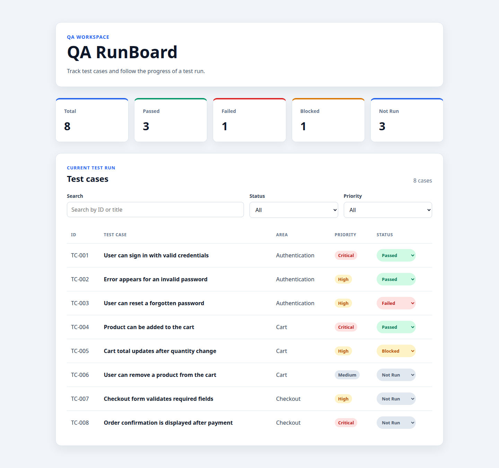

# QARunBoard

QARunBoard is a small React and TypeScript test-run dashboard built to demonstrate a disciplined, reviewable engineering workflow. It presents a local demo dataset of test cases, summarizes run status, and helps users narrow the table with client-side search and filters.



## Current functionality

- Test case dashboard with ID, title, area, priority, and status
- Summary cards for total, passed, failed, blocked, and not-run cases
- Direct status changes from each test case row
- Case-insensitive search by test case ID or title
- Single-select Status and Priority filters that combine with search
- Live visible-result count and an accessible empty state
- Responsive table and filter layouts for desktop and narrow screens
- Lightweight CSS design tokens, visible focus styles, labelled controls, and text-backed status badges

Status changes are intentionally in-memory only. Summary cards recalculate from the current test-case state, while Search, Status, and Priority filters remain consistent with those changes. Reloading restores the original demo data.

## Technology

- React
- TypeScript
- Vite
- CSS
- Playwright
- GitHub Actions

## Engineering workflow

The repository makes its AI-assisted development process explicit and reviewable. Product changes start with a feature specification in `docs/specs/`. Project-level rules in `AGENTS.md` define scope, Git safety, validation, and Definition of Done. A configured `code_writer` handles implementation, while a separate read-only `code_reviewer` checks the resulting diff. Reusable Skills describe the implementation and review workflows.

When a requirement is materially unclear, the workflow calls for clarification instead of inventing product behaviour. AI tooling supports the process; completion still depends on explicit acceptance criteria, validation, and independent review.

`Specification → AI implementation → Local validation → Independent review → Pull Request → GitHub Actions CI`

## Automated validation

- Oxlint checks the source with `npm run lint`.
- TypeScript and Vite create a production build with `npm run build`.
- Chromium-only Playwright journeys validate loading, status changes, summary recalculation, reload reset, search, combined Status and Priority filters, and the empty state.
- GitHub Actions runs dependency installation, lint, build, Chromium installation, and E2E tests on pushes to `main` and pull requests targeting `main`.

## Repository structure

```text
src/                         React components, demo data, types, and CSS
tests/e2e/                   Playwright search-and-filter journey
docs/specs/                  Feature specifications and template
.agents/skills/              Reusable implementation and review workflows
.codex/agents/               Writer and read-only reviewer configurations
.github/workflows/ci.yml     Main-branch and pull-request validation
playwright.config.ts         Chromium E2E and Vite web-server configuration
AGENTS.md                    Project engineering and AI workflow rules
```

## Run locally

Prerequisites: Node.js 24 and npm.

```bash
npm ci
npm run dev
```

Open the local URL printed by Vite.

## Run validation

Install the Playwright Chromium browser once on a local machine:

```bash
npx playwright install chromium
```

Then run the project checks:

```bash
npm run lint
npm run build
npm run test:e2e
```

Playwright starts the Vite application automatically for the E2E test.

## Engineering learnings

- Feature specifications and explicit open questions keep ambiguous product decisions out of implementation.
- Independent review provides a separate check on correctness, scope, workflow consistency, and validation evidence.
- Small, focused diffs make changes easier to inspect and reduce the risk of unrelated regressions.

## Current scope and future improvements

QARunBoard currently uses a static local demo dataset. Status edits are in-memory only; it does not include a backend, persistence, authentication, broader test-case editing, or live test-run integrations.

Potential future work could add persisted test runs, editing workflows, richer reporting, and broader automated coverage. These are possible extensions, not implemented features.
